# Open Code Review：Review 与 Map 流程详解

本文面向刚接触 `open-code-review` 的新人，目标是把项目里的 **review** 与 **map** 两条核心流程讲清楚：从命令如何被触发、AI 如何被唤起、状态如何写入 SQLite、产物如何落盘，到 Dashboard 如何解析并展示结果。

> 代码阅读时间：2026-05-14  
> 阅读范围：`packages/agents`、`packages/cli`、`packages/dashboard`、`packages/shared/graph`、`.ocr/commands`、`.ocr/skills/references`、`openspec/specs/*`、`openspec/changes/add-code-review-graph-context/*`

---

## 1. 一句话理解项目

Open Code Review 不是一个传统意义上“CLI 内部自己完成全部 review/map 编排”的工具。它的真实模型是：

> **OCR 把 review/map 工作流安装成 AI 可执行的技能与 slash command；宿主 AI CLI 负责按指令执行多阶段编排；OCR CLI 负责状态机、结构化元数据、团队配置、生命周期日志和图谱命令；内部 graph engine 负责代码图谱、影响半径、测试缺口和 flow 信号；Dashboard 负责启动 AI、消费产物、展示进度和结果。**

因此理解项目时要先分清四层：

| 层级 | 主要目录 | 责任 |
|---|---|---|
| Agent 指令层 | `packages/agents`、`.ocr/commands`、`.ocr/skills` | 定义 `/ocr-review`、`/ocr-map`、review 8 阶段、map 6 阶段、reviewer persona、输出模板 |
| CLI 状态层 | `packages/cli/src` | 安装 OCR、维护 `.ocr/data/ocr.db`、状态迁移、团队解析、agent session 日志、进度显示、resume |
| 内部图谱层 | `packages/shared/graph` | 构建 `.ocr/data/graph.db`，提供 Tree-sitter-first 解析、增量更新、查询、影响分析、graph context 和 affected flows |
| Dashboard 服务层 | `packages/dashboard/src/server` | Web 服务、Socket 命令入口、AI CLI 适配、文件/DB 同步、Markdown/JSON 解析、API |
| Dashboard 前端层 | `packages/dashboard/src/client` | Command Center、Sessions、Review Round、Map Run、Team、Chat、进度和结果展示 |

---

## 2. 项目结构速览

```text
open-code-review/
├── packages/
│   ├── agents/
│   │   ├── commands/                     # 发布给 AI 工具的命令模板，如 review.md、map.md
│   │   └── skills/ocr/
│   │       ├── SKILL.md                  # OCR skill 总入口，定义 Tech Lead / Map Architect 角色
│   │       └── references/               # review/map 工作流、模板、persona、session 文件清单
│   ├── cli/
│   │   └── src/
│   │       ├── commands/                 # ocr init/state/session/team/progress/review/dashboard 等
│   │       ├── commands/graph.ts         # ocr graph status/build/update/query/impact/context
│   │       └── lib/
│   │           ├── state/                # SQLite workflow state
│   │           ├── db/                   # schema、query、agent-session journal
│   │           ├── progress/             # review/map 进度策略
│   │           ├── team-config.ts        # default_team 三种配置形态解析
│   │           └── installer.ts          # 安装 .ocr/commands、.ocr/skills、config
│   ├── dashboard/
│   │   └── src/
│   │       ├── server/
│   │       │   ├── socket/command-runner.ts       # Dashboard 启动 review/map 的核心入口
│   │       │   ├── services/ai-cli/               # Claude Code / OpenCode 适配器
│   │       │   ├── services/filesystem-sync.ts    # 解析 .ocr/sessions 产物入库
│   │       │   ├── services/db-sync-watcher.ts    # 同步 CLI 写入的 ocr.db
│   │       │   ├── routes/graph.ts                # graph status/query API
│   │       │   └── routes/                        # sessions/reviews/maps/artifacts 等 API
│   │       └── client/features/
│   │           ├── commands/              # Command Center
│   │           ├── graph/                 # Graph status badge 与 graph-context 卡片
│   │           ├── reviews/               # Review round 页面
│   │           ├── map/                   # Map run 页面
│   │           └── sessions/              # Session 详情和进度
│   ├── shared/
│   │   └── graph/                         # 内部图谱引擎，不单独发布
│   │       └── src/
│   │           ├── storage/               # graph.db schema、GraphStore
│   │           ├── parsers/               # Tree-sitter WASM runtime 与语言解析
│   │           ├── indexer/               # full/update、Node resolver、flow detection
│   │           ├── query/                 # callers/callees/imports/impact
│   │           └── context/               # graph-context.md/json
│   └── shared/platform/                   # spawn/exec 跨平台封装
├── .ocr/                                  # 当前仓库已安装的 OCR runtime
│   ├── commands/review.md
│   ├── commands/map.md
│   ├── skills/SKILL.md
│   ├── skills/references/workflow.md
│   ├── skills/references/map-workflow.md
│   └── config.yaml
└── openspec/specs/
    ├── review-orchestration/spec.md       # review 能力规格
    └── review-map/spec.md                 # map 能力规格
```

注意两个容易误解的点：

1. `ocr review` 这个 CLI 子命令当前主要支持 `--resume <workflow-id>`，不是完整的 fresh review 编排器。fresh review 由 AI slash command 或 Dashboard 通过 AI CLI 发起。
2. `ocr map` 不是 `packages/cli/src/index.ts` 注册的本地 CLI 子命令。Dashboard 的 `command-runner` 把 `map` 当成 AI workflow command，读取 `.ocr/commands/map.md` 后交给 Claude Code / OpenCode 执行。
3. `ocr graph` 是真实 CLI 子命令，不是 AI workflow command。它由 `packages/cli/src/commands/graph.ts` 注册，调用内部 `@open-code-review/graph` API，负责构建、更新、查询 `.ocr/data/graph.db`，并为 review/map 生成 `graph-context.md/json`。

---

## 3. Runtime 安装模型

`ocr init` 会把 `packages/agents` 中的命令与技能安装到目标项目的 `.ocr/` 目录，并向 `AGENTS.md` / `CLAUDE.md` 注入 OCR 触发说明。

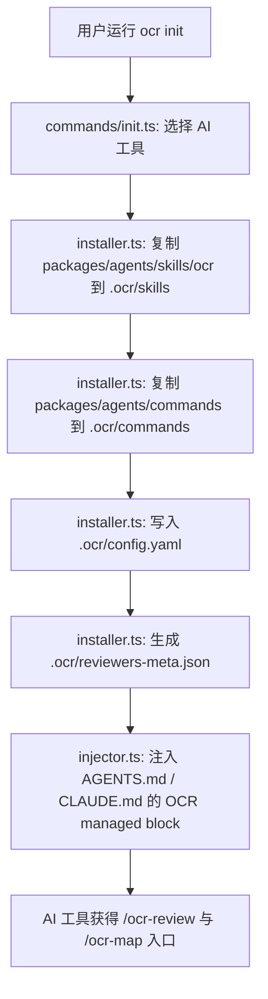

关键代码：

| 文件 | 关键逻辑 |
|---|---|
| `packages/cli/src/commands/init.ts` | 检测依赖、选择 AI 工具、调用 `installForTool()`、注入说明、输出 next steps |
| `packages/cli/src/lib/installer.ts` | 找到 `@open-code-review/agents`，复制 skills/commands，保留用户 config 与自定义 reviewers，生成 reviewers metadata |
| `packages/cli/src/lib/injector.ts` | 用 `<!-- OCR:START -->` / `<!-- OCR:END -->` 管理注入块，告诉 AI 何时读取 `.ocr/skills/SKILL.md` |
| `.ocr/commands/review.md` | slash command 的 review 指令入口，要求执行 8 阶段流程 |
| `.ocr/commands/map.md` | slash command 的 map 指令入口，要求执行 6 阶段流程 |

---

## 4. 总体运行链路

无论是 review 还是 map，都遵循同一条总体链路：

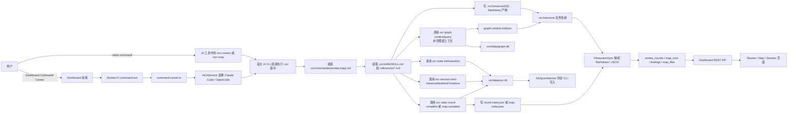

### 4.1 Dashboard 发起 AI workflow 的链路

Dashboard 不是直接在 Node 里跑 review/map 算法，而是把命令包装成 prompt，交给宿主 AI CLI：

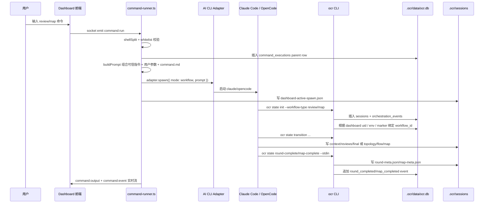

关键代码：

| 文件 | 关键逻辑 |
|---|---|
| `packages/dashboard/src/server/socket/command-runner.ts` | `registerCommandHandlers()` 处理 `command:run`；`AI_COMMANDS` 包含 `map`、`review`；`spawnAiCommand()` 读取 `.ocr/commands/{base}.md` 并启动 AI |
| `packages/dashboard/src/server/socket/command-runner.ts` | `buildPrompt()` 负责 prompt sandwich：可信 CLI Resolution、Dashboard Linkage、不可信用户参数 fenced block、命令 markdown |
| `packages/dashboard/src/server/socket/command-runner.ts` | `escapeUserHeaders()` 防止 `--reviewer`、`--requirements` 等用户输入伪造 Markdown 标题覆盖可信指令 |
| `packages/dashboard/src/server/socket/command-runner.ts` | `writeSpawnMarker()` 写 `.ocr/data/dashboard-active-spawn.json`，让后续 `ocr state init` 能稳定把 workflow 绑定回 dashboard parent execution |
| `packages/dashboard/src/server/services/ai-cli/index.ts` | `AiCliService` 检测并选择 Claude Code / OpenCode，优先 Claude，支持 `dashboard.ai_cli` 配置 |
| `packages/dashboard/src/server/services/ai-cli/claude-adapter.ts` | 使用 `claude --print --output-format stream-json`，workflow 默认 500 turns，允许 `Task` 等工具 |
| `packages/dashboard/src/server/services/ai-cli/opencode-adapter.ts` | 使用 `opencode run <prompt> --format json --agent build`，不支持 per-subagent model override |

### 4.2 内部图谱链路

图谱能力是 OCR 内部模块，不外接 `code-review-graph` 服务，也不要求用户单独安装 `@open-code-review/graph`。包位于 `packages/shared/graph`，包名是 `@open-code-review/graph`，但 `package.json` 设置了 `private: true`，并且 `nx.json` release 配置已经排除 `packages/shared/*`。

图谱链路分为三种入口：

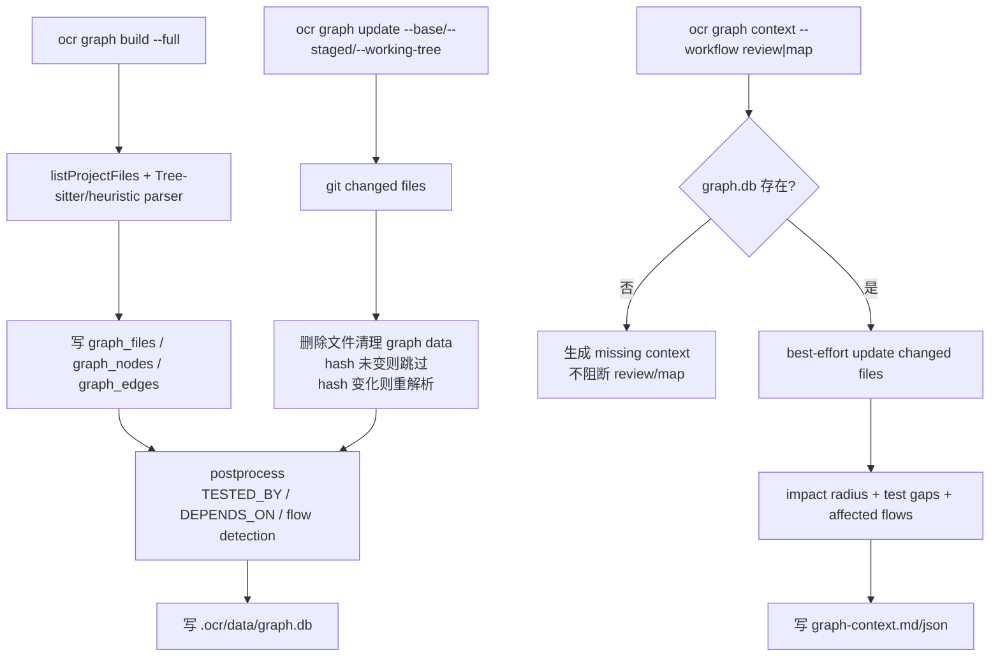

当前首批支持语言和扩展名：

| 语言 | 扩展名 | 解析方式 |
|---|---|---|
| Python | `.py` | Tree-sitter WASM 优先，失败后 heuristic fallback |
| JavaScript | `.js`、`.jsx`、`.mjs`、`.cjs` | Tree-sitter WASM + Node.js ecosystem resolver |
| TypeScript | `.ts`、`.tsx`、`.mts`、`.cts` | Tree-sitter WASM + Node.js ecosystem resolver |
| Go | `.go` | Tree-sitter WASM 优先，失败后 heuristic fallback |
| Java | `.java` | Tree-sitter WASM 优先，失败后 heuristic fallback |
| Vue | `.vue` | 解析 `<script>` / `<script lang="ts">`，内部复用 JS/TS parser |
| SQL | `.sql` | v1 使用 heuristic parser，提取表/视图/函数和基础依赖 |

核心表在独立数据库 `.ocr/data/graph.db` 中：

| 表 | 说明 |
|---|---|
| `graph_metadata` | schema/parser version、last build/update 时间 |
| `graph_files` | 文件路径、语言、hash、mtime、indexed/unsupported/error 状态 |
| `graph_nodes` | `File`、`Class`、`Function`、`Type`、`Test` 节点 |
| `graph_edges` | `CONTAINS`、`IMPORTS_FROM`、`CALLS`、`INHERITS`、`IMPLEMENTS`、`TESTED_BY`、`DEPENDS_ON`、`REFERENCES` 边 |
| `graph_flows` | 轻量业务/技术流入口和 criticality |
| `graph_flow_nodes` | flow 到节点的有序映射 |

关键实现文件：

| 文件 | 关键逻辑 |
|---|---|
| `packages/shared/graph/src/index.ts` | 对外导出 `getGraphStatus/buildGraph/updateGraph/queryGraph/getImpactRadius/generateGraphContext` |
| `packages/shared/graph/src/storage/db.ts` | `GraphStore`、schema 初始化、files/nodes/edges/flows CRUD |
| `packages/shared/graph/src/parsers/parser.ts` | Tree-sitter WASM 初始化、七类语言 parser、SQL/Vue fallback |
| `packages/shared/graph/src/indexer/indexer.ts` | full build、incremental update、删除文件清理、stale 保护 |
| `packages/shared/graph/src/indexer/node-resolver.ts` | CommonJS/ESM/package.json `main`/`exports`/`imports`、Node built-ins |
| `packages/shared/graph/src/indexer/flow-detector.ts` | 从 entry point 沿调用/依赖边生成 `graph_flows` |
| `packages/shared/graph/src/query/query.ts` | pattern query 与 impact radius |
| `packages/shared/graph/src/context/context.ts` | `graph-context.md/json` 渲染，risk/test gaps/affected flows |
| `packages/cli/src/commands/graph.ts` | `ocr graph status/build/update/query/impact/context` |

图谱降级规则很重要：

- 没有 `.ocr/data/graph.db` 时，review/map 继续执行，只在 `graph-context` 中记录 missing warning。
- parser version 变化时 `status=stale`，增量更新不会偷偷重建，要求用户执行 `ocr graph build --full`。
- unsupported 文件不会生成 nodes/edges，但会计数；如果 unsupported 文件出现在 changed files 中，会写入 `unsupportedChangedFiles`。
- 图谱结果只能指导检查路径，不能单独作为 review finding。所有 finding 必须由源码、diff、测试或运行证据验证。

---

## 5. Review 工作流详解

Review 是 8 阶段多 reviewer 编排。核心文档在：

| 文件 | 作用 |
|---|---|
| `.ocr/commands/review.md` | slash command 入口，定义 usage、required artifacts、phase 0 检查 |
| `.ocr/skills/SKILL.md` | Tech Lead 角色总说明、默认 reviewer team、requirements 输入、session 存储 |
| `.ocr/skills/references/workflow.md` | 8 阶段完整流程 |
| `.ocr/skills/references/reviewer-task.md` | 单个 reviewer task 的输入和输出格式 |
| `.ocr/skills/references/discourse.md` | reviewer 讨论阶段格式 |
| `.ocr/skills/references/final-template.md` | final.md 合成规则 |
| `.ocr/skills/references/session-files.md` | 文件结构和命名权威清单 |
| `openspec/specs/review-orchestration/spec.md` | review 能力规格 |

### 5.1 Review 总流程图

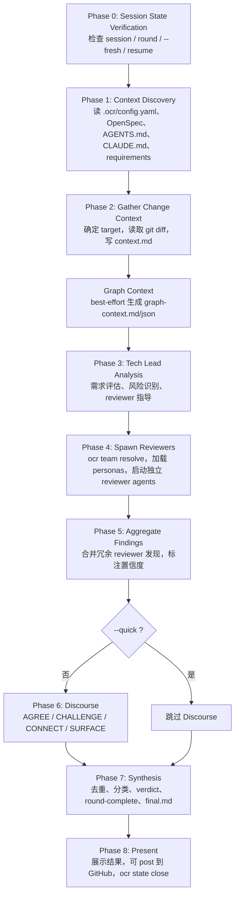

### 5.2 Phase 0：Session State Verification

Phase 0 的目标是避免重复执行或覆盖已有结果。AI 在真正 review 前必须检查：

1. 当前分支：`git branch --show-current`
2. session id：`{YYYY-MM-DD}-{branch}`，分支中的 `/` 替换成 `-`
3. session 目录：`.ocr/sessions/{session-id}`
4. SQLite 状态：`ocr state show`
5. 文件系统产物是否和 state 匹配

Round 解析规则：

| 情况 | 行为 |
|---|---|
| `--fresh` | 删除当天 session 或当前 round，重新从 phase 1 开始 |
| 没有 session | 创建 session，使用 `round-1` |
| 最高 round 已有 `final.md` | 创建 `round-{n+1}` |
| 最高 round 未完成 | 继续该 round |
| SQLite 缺失但文件存在 | 用 `ocr state init` 重建状态，再根据文件判断恢复点 |
| SQLite 与文件不一致 | 需要用户判断信任哪边 |

关键点：

- OCR 采用 **round-first architecture**，review 的每轮产物都在 `rounds/round-{n}/` 下。
- `current_phase` 表示当前活跃阶段；阶段完成与否通常通过文件存在性判断。
- `ocr progress` 依赖 state transition 和文件命名，不能跳阶段写 `final.md`。

### 5.3 Phase 1：Context Discovery

目标是生成所有 reviewer 共享的项目背景。

输入来源按优先级合并：

| 优先级 | 来源 | 说明 |
|---|---|---|
| 1 | `.ocr/config.yaml` 的 `context` 和 `rules` | 用户定制项目背景和 review 规则 |
| 2 | OpenSpec | `openspec/config.yaml`、`openspec/specs/**/*.md`、active changes |
| 3 | 引用文件 | `AGENTS.md`、`CLAUDE.md`、`.cursorrules`、`.windsurfrules`、`CONTRIBUTING.md` |
| 4 | additional | `.ocr/config.yaml` 中自定义额外文件 |
| 5 | 用户 requirements | inline 文本、文件路径、ticket、spec、验收标准 |

产物：

```text
.ocr/sessions/{session-id}/
├── discovered-standards.md
└── requirements.md          # 如果用户提供需求
```

状态命令：

```bash
ocr state init --session-id "$SESSION_ID" --branch "$BRANCH" --workflow-type review --session-dir "$SESSION_DIR"
ocr state transition --phase "context" --phase-number 1
```

关键代码与文档：

| 文件 | 关键逻辑 |
|---|---|
| `.ocr/skills/references/context-discovery.md` | 定义完整发现算法 |
| `.ocr/config.yaml` | 配置 `context_discovery`、`default_team`、`rules` |
| `packages/cli/src/commands/state.ts` | `state init` 创建 session，并尝试绑定 dashboard execution |
| `packages/cli/src/lib/state/index.ts` | `stateInit()` 插入或恢复 session |

### 5.4 Phase 2：Gather Change Context

目标是让 Tech Lead 明确“这次要审什么”。

支持 target：

| Target | 常见命令 |
|---|---|
| 默认 staged changes | `git diff --cached` |
| unstaged changes | `git diff` |
| commit/range | `git diff {range}` |
| PR | `gh pr diff {number}` |
| branch | `git diff main...{branch}` |
| 文件/目录 | 由 AI 根据用户 target 组合 git/path 命令 |

产物：

```text
.ocr/sessions/{session-id}/
├── context.md
├── graph-context.md        # best-effort，图谱缺失时也可记录 missing/stale warning
├── graph-context.json
└── rounds/
    └── round-{n}/
        └── reviews/
```

`context.md` 先写变更摘要、affected files、target、branch，Phase 3 再补充 Tech Lead guidance。

当 changed files 已知后，workflow 会 best-effort 生成图谱上下文：

```bash
ocr graph context \
  --workflow review \
  --files "src/a.ts,src/b.ts" \
  --session-dir ".ocr/sessions/{session-id}"
```

如果 workflow 以 base ref 表达 target，也可以使用：

```bash
ocr graph context \
  --workflow review \
  --base origin/main \
  --session-dir ".ocr/sessions/{session-id}"
```

`graph-context.json` 的关键字段：

| 字段 | 说明 |
|---|---|
| `status` | `ready`、`missing`、`stale`、`error` |
| `changedFiles` | workflow 传入的 changed files；权威来源仍是 git |
| `changedRanges` | 从 `git diff --unified=0` 提取的变更行范围；用于把 file-level 变更收窄到 symbol-level |
| `unsupportedChangedFiles` | changed files 中 graph v1 不支持解析的文件 |
| `changedNodes` | 优先为与 changed ranges 重叠的 changed symbols；拿不到 diff range 或未命中 symbol 时回退为 file-level graph nodes |
| `impactedNodes` / `impactedFiles` | impact radius 结果 |
| `affectedFlows` | changed/impacted nodes 命中的轻量 flow |
| `testGaps` | changed function 没有 `TESTED_BY` 边的提示 |
| `riskScore` / `riskLevel` | 基于 impact、test gaps、unsupported、affected flows 的启发式风险 |
| `reviewPriorities` | 建议优先查看的符号 |
| `suggestedQuestions` / `warnings` | reviewer 应关注的问题和 graph 降级信息 |

状态命令：

```bash
ocr state transition --phase "change-context" --phase-number 2 --current-round "$CURRENT_ROUND"
```

### 5.5 Phase 3：Tech Lead Analysis

目标是做一次“review 前的技术负责人判断”。

Tech Lead 需要：

1. 读 requirements，判断代码应该实现什么。
2. 读 diff，判断代码实际改了什么。
3. 读 `graph-context.md/json`（如果存在），优先关注 changed symbols / changed ranges，再把 impact radius、affected flows、test gaps、unsupported changed files 当作检查线索。
4. 如果用户明确说“使用已有 map”，才读取 `.ocr/sessions/{id}/map/runs/*/map.md`，否则 review 不自动依赖 map。
5. 总结风险领域，例如 security、testing、architecture、performance。
6. 生成给 reviewer 的动态指导。
7. 准备 reviewer team，但最终 Phase 4 要通过 `ocr team resolve --json` 获取真实 team。

`context.md` 会被扩展为类似：

```markdown
## Tech Lead Guidance

### Requirements Summary
...

### Change Summary
...

### Requirements Assessment
...

### Clarifying Questions
...

### Risk Areas
...

### Graph Context
- Risk Level: medium
- Impacted Files: ...
- Affected Flows: ...
- Test Gaps: ...
- Unsupported Changed Files: ...

### Focus Points
...
```

状态命令：

```bash
ocr state transition --phase "analysis" --phase-number 3 --current-round "$CURRENT_ROUND"
```

### 5.6 Phase 4：Spawn Reviewers

这是 review 流程最核心的阶段。AI Tech Lead 会启动多个独立 reviewer agents。每个 reviewer 收到 persona、项目背景、requirements、Tech Lead guidance、diff，并可以自由探索代码。

如果存在 graph context，reviewer task 会带上 Graph Context 小节，并允许 reviewer 继续查询图谱：

```bash
ocr graph query callers_of --target "<qualified-name>" --json
ocr graph query callees_of --target "<qualified-name>" --json
ocr graph query imports_of --target "src/file.ts" --json
ocr graph query importers_of --target "src/file.ts" --json
ocr graph query tests_for --target "<qualified-name>" --json
ocr graph impact --files "src/file.ts" --depth 2 --json
```

约束：图谱只能指导 reviewer 优先检查哪里。reviewer 不能只凭 `CALLS` 边、impact radius、affected flow、test gap 或 unsupported warning 提交 finding；每条 finding 必须引用源码、diff、测试或运行证据。

#### 5.6.1 Team 解析

不要手写解析 `.ocr/config.yaml` 的 `default_team`，而是调用：

```bash
ocr team resolve --json
```

原因：`default_team` 支持三种形态，且支持 model alias、workspace default model、session override。

```yaml
default_team:
  principal: 2
  quality:
    count: 2
    model: claude-sonnet-4-6
  security:
    - model: claude-opus-4-7
      name: security-deep
```

解析后的统一结构：

```json
[
  {
    "persona": "principal",
    "instance_index": 1,
    "name": "principal-1",
    "model": null
  }
]
```

关键代码：

| 文件 | 关键逻辑 |
|---|---|
| `packages/cli/src/commands/team.ts` | `ocr team resolve --json` 命令入口 |
| `packages/cli/src/lib/team-config.ts` | `parseTeamConfigYaml()` 解析三种 team 形态，`resolveTeamComposition()` 应用 session override |

#### 5.6.2 Reviewer 输出命名

每个 reviewer 输出到：

```text
.ocr/sessions/{session-id}/rounds/round-{n}/reviews/{persona}-{instance_index}.md
```

示例：

```text
reviews/
├── principal-1.md
├── principal-2.md
├── quality-1.md
├── quality-2.md
├── security-1.md
└── ephemeral-1.md
```

命名必须是 `{slug}-{n}.md`，否则 progress 和 dashboard parser 都可能识别不准。

#### 5.6.3 Agent session journaling

每个 reviewer agent 的生命周期都要写入 journal。当前实现中 “agent session” 已统一落在 `command_executions` 表里，而不是单独的 `agent_sessions` 表。

标准命令：

```bash
AGENT_ID=$(ocr session start-instance \
  --workflow "$SESSION_ID" \
  --persona principal \
  --instance 1 \
  --name principal-1 \
  --vendor claude \
  --model claude-opus-4-7)

ocr session bind-vendor-id "$AGENT_ID" "<vendor-session-id>"
ocr session beat "$AGENT_ID"
ocr session end-instance "$AGENT_ID" --exit-code 0
```

关键代码：

| 文件 | 关键逻辑 |
|---|---|
| `packages/cli/src/commands/session.ts` | `start-instance`、`bind-vendor-id`、`beat`、`end-instance`、`list` |
| `packages/cli/src/lib/db/agent-sessions.ts` | 用 `command_executions` 表模拟 agent session 视图，按 `finished_at`、`exit_code`、`last_heartbeat_at` 推导状态 |
| `packages/dashboard/src/server/routes/agent-sessions.ts` | Dashboard 查询 reviewer/agent liveness |

#### 5.6.4 Per-instance model

Claude Code adapter 支持 per-task model override，OpenCode adapter 当前不支持。

| Host | `supportsPerTaskModel` | 行为 |
|---|---:|---|
| Claude Code | `true` | reviewer subagent 可以带自己的 model |
| OpenCode | `false` | Dashboard 输出 warning，所有 reviewer 使用 parent model |

关键代码：

| 文件 | 关键逻辑 |
|---|---|
| `packages/dashboard/src/server/services/ai-cli/types.ts` | `supportsPerTaskModel` adapter contract |
| `packages/dashboard/src/server/services/ai-cli/claude-adapter.ts` | Claude 支持 per-subagent model |
| `packages/dashboard/src/server/services/ai-cli/opencode-adapter.ts` | OpenCode 标记为不支持 |
| `packages/dashboard/src/server/socket/command-runner.ts` | `extractPerInstanceModels()` + adapter capability warning |

状态命令：

```bash
ocr state transition --phase "reviews" --phase-number 4 --current-round "$CURRENT_ROUND"
```

### 5.7 Phase 5：Aggregate Findings

目标是合并冗余 reviewer 的发现，并标注置信度。

聚合规则：

| 情况 | 置信度 |
|---|---|
| 同一 persona 的所有冗余实例都发现 | Very High / confirmed |
| 多数实例发现 | Medium / partial |
| 只有一个实例发现 | Lower / single observation |
| 多个不同 persona 都发现 | synthesis 时进一步加权 |

这个阶段主要由 AI Tech Lead 在上下文里完成，不对应单独产物文件。它必须在进入 discourse 前完成。

状态命令：

```bash
ocr state transition --phase "aggregation" --phase-number 5 --current-round "$CURRENT_ROUND"
```

### 5.8 Phase 6：Discourse

目标是让 reviewer 互相回应，而不是简单拼接结果。

固定响应类型：

| 类型 | 含义 |
|---|---|
| `AGREE` | 认可其他 reviewer 发现，提高置信度 |
| `CHALLENGE` | 反驳或要求证据 |
| `CONNECT` | 连接不同 reviewer 的发现 |
| `SURFACE` | 在讨论中产生新关注点 |

产物：

```text
.ocr/sessions/{session-id}/rounds/round-{n}/discourse.md
```

如果用户使用 `--quick`，该阶段可跳过。

状态命令：

```bash
ocr state transition --phase "discourse" --phase-number 6 --current-round "$CURRENT_ROUND"
```

### 5.9 Phase 7：Synthesis

目标是产出最终 review。

输入：

```text
discovered-standards.md
requirements.md                 # 可选
context.md
graph-context.md/json           # 可选，作为 review 线索
rounds/round-{n}/reviews/*.md
rounds/round-{n}/discourse.md   # 可选，quick 模式可能没有
```

Synthesis 阶段可以引用 graph context，但必须保守：只有当 graph 线索已经被 reviewer 或 Tech Lead 用源码、diff、测试或运行证据验证过，才能进入 `final.md`。不能因为 `riskLevel=high`、`affectedFlows` 命中或 `testGaps` 存在就直接生成 blocker。

输出：

```text
rounds/round-{n}/round-meta.json # 由 ocr state round-complete --stdin 写
rounds/round-{n}/final.md        # 人类阅读的最终 review
```

#### 5.9.1 final.md 分类规则

`final-template.md` 的核心思想是“模拟真实工程团队”：

| 分类 | 合并规则 |
|---|---|
| Blockers | 任何 reviewer 指出安全漏洞、数据完整性、正确性 bug、无迁移破坏性变更等，都可以 block |
| Should Fix | 非阻塞但应该修的问题，如错误处理、潜在 bug、重要重构、缺少边界校验 |
| Suggestions | 风格、文档、轻量重构、额外测试建议 |
| What's Working Well | 正向反馈 |
| Clarifying Questions | 所有关于需求、边界、edge case 的问题必须显著保留 |

Verdict 规则：

| 条件 | Verdict |
|---|---|
| 任意 blocker | `REQUEST CHANGES` |
| 无 blocker 但关键需求问题未澄清 | `NEEDS DISCUSSION` |
| 只有建议或无问题 | `APPROVE` |

#### 5.9.2 round-complete 结构化数据

AI 不能直接手写 `round-meta.json`，应把 JSON pipe 给 CLI：

```bash
cat <<'JSON' | ocr state round-complete --stdin
{
  "schema_version": 1,
  "verdict": "REQUEST CHANGES",
  "synthesis_counts": {
    "blockers": 1,
    "should_fix": 3,
    "suggestions": 5
  },
  "reviewers": [
    {
      "type": "principal",
      "instance": 1,
      "findings": [
        {
          "title": "Example finding",
          "category": "blocker",
          "severity": "high",
          "file_path": "src/example.ts",
          "line_start": 42,
          "line_end": 45,
          "summary": "..."
        }
      ]
    }
  ]
}
JSON
```

关键点：

- `synthesis_counts` 必须等于 `final.md` 中去重后的最终数量。
- finding 的 `category` 是 synthesis 后分类，不是 reviewer 原始标签。
- CLI 校验 schema 后写 `round-meta.json` 并插入 `round_completed` event。

关键代码：

| 文件 | 关键逻辑 |
|---|---|
| `packages/cli/src/commands/state.ts` | `round-complete` 命令入口 |
| `packages/cli/src/lib/state/index.ts` | `validateRoundMeta()`、`computeRoundCounts()`、`stateRoundComplete()` |
| `packages/dashboard/src/server/services/filesystem-sync.ts` | `processRoundMeta()` 读取 `round-meta.json`，填充 `review_rounds`、`reviewer_outputs`、`review_findings` |

状态命令：

```bash
ocr state transition --phase "synthesis" --phase-number 7 --current-round "$CURRENT_ROUND"
ocr state round-complete --stdin
```

### 5.10 Phase 8：Present

目标是展示结果，并关闭 session。

行为：

1. 读取 `rounds/round-{n}/final.md`
2. 展示 verdict、blockers、should fix、suggestions
3. 如果带 `--post` 或 PR target，可通过 GitHub CLI 发评论
4. 调用 `ocr state close`

状态命令：

```bash
ocr state close --session-id "$SESSION_ID"
```

关闭后：

- `sessions.status` 变为 `closed`
- `current_phase` 变为 `complete`
- `ocr progress` 不再显示该 session 为活跃
- Dashboard 历史仍可查看

---

## 6. Map 工作流详解

Map 是给人类 reviewer 使用的导航文档，不是最终 review。它适合巨大 changeset，用于回答：

- 这些文件应该按什么顺序审？
- 哪些文件属于同一个业务/技术流？
- 每个文件的上游/下游关系是什么？
- 哪些改动覆盖了哪些需求？
- 有没有看起来不相关的文件？

核心文档：

| 文件 | 作用 |
|---|---|
| `.ocr/commands/map.md` | slash command 入口 |
| `.ocr/skills/references/map-workflow.md` | 6 阶段 map 流程 |
| `.ocr/skills/references/map-template.md` | `map.md` 输出格式 |
| `.ocr/skills/references/map-agent-task.md` | map agent task 模板 |
| `.ocr/skills/references/map-personas/flow-analyst.md` | Flow Analyst persona |
| `.ocr/skills/references/map-personas/requirements-mapper.md` | Requirements Mapper persona |
| `openspec/specs/review-map/spec.md` | map 能力规格 |

### 6.1 Map 总流程图

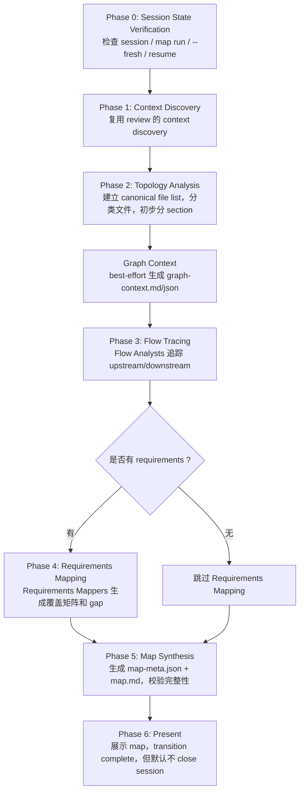

### 6.2 Phase 0：Map Run Resolution

Map 与 review 的 round 类似，但叫 run：

```text
.ocr/sessions/{session-id}/map/runs/run-{n}/
```

解析规则：

| 情况 | 行为 |
|---|---|
| `--fresh` | 删除 `.ocr/sessions/{id}/map`，从 `run-1` 开始 |
| 无 map/runs | 创建 `run-1` |
| 最高 run 有 `map.md` | 创建 `run-{n+1}` |
| 最高 run 未完成 | 继续该 run |

状态命令：

```bash
ocr state init --session-id "$SESSION_ID" --branch "$BRANCH" --workflow-type map --session-dir "$SESSION_DIR"
ocr state transition --phase "map-context" --phase-number 1 --current-map-run "$CURRENT_RUN"
```

如果 session 已存在，比如先跑过 review 再跑 map，则不用重复 init，只 transition 到 map phase。

### 6.3 Phase 1：Context Discovery

Map 的 context discovery 与 review 完全共享：

```text
.ocr/sessions/{session-id}/
├── discovered-standards.md
└── requirements.md          # 可选
```

额外读取 map agent redundancy 配置：

```yaml
code-review-map:
  agents:
    flow_analysts: 2
    requirements_mappers: 2
```

如果配置缺失，默认 `flow_analysts=2`、`requirements_mappers=2`，范围应限制在 1 到 10。

### 6.4 Phase 2：Topology Analysis

目标是建立“所有 changed files 的权威列表”，后续 completeness validation 以此为准。

典型命令：

```bash
git diff --cached --name-only > /tmp/ocr-canonical-files.txt
```

需要完成：

1. 获取 target 对应 changed file list。
2. 保存 canonical file list。
3. best-effort 调用 `ocr graph context --workflow map` 生成 `graph-context.md/json`。
4. 把文件分类为 entry points、core logic、infrastructure、tests、docs。
5. 参考 `changedNodes`、`changedRanges`、`impactedFiles`、`affectedFlows`、`unsupportedChangedFiles` 辅助分组，但 canonical file list 仍以 git changed files 为准。
6. 初步分 logical sections。
7. 生成建议 review order。

产物：

```text
map/runs/run-{n}/topology.md
```

状态命令：

```bash
ocr state transition --phase "topology" --phase-number 2 --current-map-run "$CURRENT_RUN"
```

### 6.5 Phase 3：Flow Tracing

目标是让多个 Flow Analyst 独立追踪每个 changed file 的上下游。

每个 Flow Analyst 需要：

- 找 entry point：API endpoint、CLI command、event handler、UI route 等。
- 追 downstream：changed code 调了什么。
- 追 upstream：谁调用 changed code。
- 使用 graph context 和 `ocr graph query imports_of/importers_of/callers_of/callees_of/tests_for` 做辅助探索。
- 使用 `affectedFlows` 识别可能的业务/技术流，但必须把结论写成 hypothesis。
- 找 related tests、config、sibling implementation。
- 提出 section grouping 和 review order。
- 说明探索依据。

产物：

```text
map/runs/run-{n}/flow-analysis.md
```

聚合规则：

| 情况 | 处理 |
|---|---|
| 多个 analyst 找到同一调用关系 | 高置信度 |
| 只有一个 analyst 找到 | 仍保留，中置信度 |
| section assignment 不一致 | 多数优先，无多数则 Map Architect 决策并记录 |
| upstream/downstream 发现不同 | 合并 union |

状态命令：

```bash
ocr state transition --phase "flow-analysis" --phase-number 3 --current-map-run "$CURRENT_RUN"
```

### 6.6 Phase 4：Requirements Mapping

仅当用户提供 requirements 时执行。

每个 Requirements Mapper 需要：

1. 把 requirements 拆成离散条目。
2. 将每个 changed file / section 映射到 requirement。
3. 标注 coverage：Full / Partial / None / Cannot assess。
4. 识别未覆盖需求、部分覆盖、疑似无关改动。
5. 对 mapper 之间的分歧采用保守策略。

产物：

```text
map/runs/run-{n}/requirements-mapping.md
```

如果没有 requirements，phase 可跳过，但 state 仍应进入后续 synthesis。

状态命令：

```bash
ocr state transition --phase "requirements-mapping" --phase-number 4 --current-map-run "$CURRENT_RUN"
```

### 6.7 Phase 5：Map Synthesis

目标是生成最终 Code Review Map。

输入：

```text
topology.md
flow-analysis.md
requirements-mapping.md      # 可选
canonical file list
```

输出：

```text
map/runs/run-{n}/map-meta.json # 由 ocr state map-complete --stdin 写
map/runs/run-{n}/map.md        # 人类阅读的导航文档
```

#### 6.7.1 map.md 结构

`map-template.md` 定义的顺序：

1. Executive Summary
2. Questions & Clarifications
3. Requirements Coverage
4. Critical Review Focus
5. Manual Verification
6. File Review
7. Section Dependencies
8. File Index
9. Map Metadata

核心原则：

- section narrative 要写成 **hypothesis**，不要写成未经验证的事实。
- 增加 “Graph Signals” 说明图谱给出的 changed symbols、changed ranges、impacted files、affected flows、test gaps、unsupported changed files；这些信号只辅助导航，不替代人工确认。
- 每个 section 有 file table / checkbox，便于人类 reviewer 跟踪进度。
- Unrelated Changes 放最后。
- 每个 changed file 必须出现在 map 里。
- map 只提示 review focus，不执行真正 code review。

#### 6.7.2 map-complete 结构化数据

AI 不能直接手写 `map-meta.json`，应 pipe 给 CLI：

```bash
cat <<'JSON' | ocr state map-complete --stdin
{
  "schema_version": 1,
  "sections": [
    {
      "section_number": 1,
      "title": "Authentication Flow",
      "description": "Auth entry points and token validation",
      "files": [
        {
          "file_path": "src/auth.ts",
          "role": "API entry point",
          "lines_added": 10,
          "lines_deleted": 2
        }
      ]
    }
  ],
  "dependencies": [
    {
      "from_section": 1,
      "from_title": "Authentication Flow",
      "to_section": 2,
      "to_title": "Session Storage",
      "relationship": "creates sessions"
    }
  ]
}
JSON
```

关键代码：

| 文件 | 关键逻辑 |
|---|---|
| `packages/cli/src/commands/state.ts` | `map-complete` 命令入口 |
| `packages/cli/src/lib/state/index.ts` | `validateMapMeta()`、`computeMapCounts()`、`stateMapComplete()` |
| `packages/dashboard/src/server/services/filesystem-sync.ts` | `processMapMeta()` 读取 `map-meta.json`，填充 `map_runs`、`map_sections`、`map_files` |

状态命令：

```bash
ocr state transition --phase "synthesis" --phase-number 5 --current-map-run "$CURRENT_RUN"
ocr state map-complete --stdin
```

### 6.8 Phase 6：Present

Map 完成后展示 `map.md`。

状态命令：

```bash
ocr state transition --phase "complete" --phase-number 6 --current-map-run "$CURRENT_RUN"
```

注意：map complete 默认 **不 close session**，因为用户可能随后继续跑 review 或再次生成 map。

---

## 7. Review 与 Map 的关系

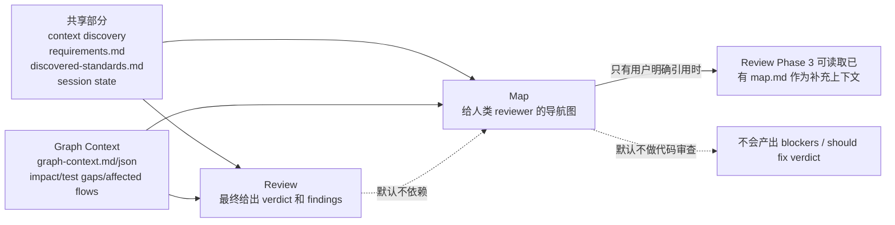

对新人最重要的判断：

| 问题 | 答案 |
|---|---|
| 先 map 再 review 是强制的吗？ | 不是。Map 是独立工具。 |
| review 会自动读取 map 吗？ | 不会，只有用户明确提到已有 map 时才读。 |
| review 和 map 都会使用 graph context 吗？ | 会在 changed files 已知后 best-effort 生成和读取；graph 缺失、stale、unsupported 不阻断流程。 |
| map 会给出最终 approve/request changes 吗？ | 不会。Map 是导航与覆盖分析，不是 code review 结论。 |
| 两者能共用一个 session 吗？ | 可以，共用 `discovered-standards.md`、`requirements.md`，但 review 用 rounds，map 用 runs。 |
| Dashboard 如何区分？ | session 表有 `workflow_type/current_phase`，同时通过 artifact 派生 `has_review/has_map`。 |

---

## 8. Session 文件结构

权威文档：`.ocr/skills/references/session-files.md`

```text
.ocr/sessions/{YYYY-MM-DD}-{branch}/
├── discovered-standards.md
├── requirements.md
├── context.md
├── graph-context.md
├── graph-context.json
├── map/
│   └── runs/
│       ├── run-1/
│       │   ├── topology.md
│       │   ├── flow-analysis.md
│       │   ├── requirements-mapping.md
│       │   ├── map-meta.json
│       │   └── map.md
│       └── run-2/
│           └── ...
└── rounds/
    ├── round-1/
    │   ├── reviews/
    │   │   ├── principal-1.md
    │   │   ├── principal-2.md
    │   │   ├── quality-1.md
    │   │   └── quality-2.md
    │   ├── discourse.md
    │   ├── round-meta.json
    │   └── final.md
    └── round-2/
        └── ...
```

共享 artifact：

| 文件 | 说明 |
|---|---|
| `discovered-standards.md` | 项目背景，review/map 共用 |
| `requirements.md` | 用户需求，review/map 共用 |
| `context.md` | review 的变更摘要和 Tech Lead guidance |
| `graph-context.md` | review/map 共用的图谱摘要，包含 risk、changed symbols、changed ranges、impacted files、affected flows、test gaps、unsupported files、warnings |
| `graph-context.json` | `GraphContext` 结构化数据，供 Dashboard 和后续工具读取 |

Review round artifact：

| 文件 | 说明 |
|---|---|
| `rounds/round-{n}/reviews/*.md` | 单个 reviewer 输出 |
| `rounds/round-{n}/discourse.md` | reviewer 讨论 |
| `rounds/round-{n}/round-meta.json` | 结构化 findings 和 counts |
| `rounds/round-{n}/final.md` | 最终 review |

Map run artifact：

| 文件 | 说明 |
|---|---|
| `map/runs/run-{n}/topology.md` | 文件分类和初步 section |
| `map/runs/run-{n}/flow-analysis.md` | 上下游依赖分析 |
| `map/runs/run-{n}/requirements-mapping.md` | 需求覆盖 |
| `map/runs/run-{n}/map-meta.json` | 结构化 sections/files/dependencies |
| `map/runs/run-{n}/map.md` | 最终 map |

---

## 9. SQLite 数据模型与写入责任

数据库位置：

```text
.ocr/data/ocr.db     # workflow/session/dashboard state
.ocr/data/graph.db   # code graph，独立于 ocr.db
```

### 9.1 主要表

| 表 | 责任 | 说明 |
|---|---|---|
| `sessions` | CLI state + Dashboard sync | 当前 workflow 状态、phase、round/run、session_dir |
| `orchestration_events` | CLI state | phase transition、round_completed、map_completed、session_closed 等事件 |
| `command_executions` | Dashboard + CLI session journal | Dashboard parent AI process、AI 子 agent lifecycle、vendor session id、heartbeat、exit_code |
| `review_rounds` | Dashboard parser/sync | round verdict、counts、final path、source |
| `reviewer_outputs` | Dashboard parser/sync | reviewer 文件和 finding 数量 |
| `review_findings` | Dashboard parser/sync | finding title/severity/location/category |
| `markdown_artifacts` | Dashboard parser/sync | raw markdown content，供 UI 和 chat 使用 |
| `map_runs` | Dashboard parser/sync | map run count、file_count、section_count |
| `map_sections` | Dashboard parser/sync | section title/description/file_count |
| `map_files` | Dashboard parser/sync | section 下的文件、role、行数 |
| `user_file_progress` | Dashboard | map 文件勾选状态 |
| `user_finding_progress` | Dashboard | finding triage 状态 |
| `user_round_progress` | Dashboard | round triage 状态 |
| `chat_conversations` / `chat_messages` | Dashboard | Ask the Team |

### 9.1.1 graph.db 表

`graph.db` 不参与 review/map state machine，也不存 `round-meta.json` 或 `map-meta.json`。它是可重建缓存，默认位于 `.ocr/data/graph.db`，随 `.ocr/data/` 被忽略。

| 表 | 责任 | 说明 |
|---|---|---|
| `graph_metadata` | graph engine | schema/parser version、last full build、last update |
| `graph_files` | graph indexer | 文件 hash、语言、mtime、indexed/unsupported/error |
| `graph_nodes` | parsers | `File`、`Class`、`Function`、`Type`、`Test` |
| `graph_edges` | parsers/postprocess | imports、calls、inheritance、test、dependency、reference |
| `graph_flows` | flow detector | 从 entry point 推导出的轻量 flow 和 criticality |
| `graph_flow_nodes` | flow detector | flow 到节点的有序映射 |

### 9.2 双写模型

Dashboard 和 CLI 都使用 sql.js，但写不同数据域：

| 写入方 | 主要写入 |
|---|---|
| CLI | `sessions`、`orchestration_events`、`command_executions` 的 agent lifecycle 字段、`round-meta.json`、`map-meta.json` |
| Graph engine | `.ocr/data/graph.db`、`graph-context.md/json` |
| Dashboard | `command_executions` parent row、parsed artifact tables、用户进度、chat、notes |

并发保护：

1. CLI/Dashboard 写 DB 都采用 temp file + rename 的原子写。
2. Dashboard `saveDb()` 前调用 `DbSyncWatcher.syncFromDisk()` 合并 CLI 改动，避免覆盖。
3. `DbSyncWatcher` 监听 `.ocr/data/ocr.db`，把 CLI 写入同步到 Dashboard 内存 DB。
4. `FilesystemSync` 监听 `.ocr/sessions`，把 Markdown/JSON 产物解析进 Dashboard 表。

关键代码：

| 文件 | 关键逻辑 |
|---|---|
| `packages/cli/src/lib/db/migrations.ts` | 定义 schema，migration v11 把 agent_sessions 合并进 command_executions |
| `packages/dashboard/src/server/db.ts` | Dashboard DB 打开、saveDb、双写责任说明、merge-before-write |
| `packages/dashboard/src/server/services/db-sync-watcher.ts` | 监听 ocr.db，sync sessions/events/command_executions |
| `packages/dashboard/src/server/services/filesystem-sync.ts` | 监听 `.ocr/sessions` 并解析 artifacts |

---

## 10. State 命令与状态机

CLI 的状态命令入口：

```text
packages/cli/src/commands/state.ts
```

底层实现：

```text
packages/cli/src/lib/state/index.ts
```

### 10.1 Review phase values

```text
context
change-context
analysis
reviews
aggregation
discourse
synthesis
complete
```

### 10.2 Map phase values

```text
map-context
topology
flow-analysis
requirements-mapping
synthesis
complete
```

### 10.3 核心 API

| 命令 | 作用 | 实现函数 |
|---|---|---|
| `ocr state init` | 创建或恢复 session | `stateInit()` |
| `ocr state transition` | 更新 current_phase/phase_number/current_round/current_map_run，插入 event | `stateTransition()` |
| `ocr state close` | 标记 session closed | `stateClose()` |
| `ocr state show` | 查看 active/latest session | `stateShow()` |
| `ocr state sync` | 从文件系统 backfill session | `stateSync()` |
| `ocr state round-complete` | 校验 round JSON，写 `round-meta.json`，插入 `round_completed` | `stateRoundComplete()` |
| `ocr state map-complete` | 校验 map JSON，写 `map-meta.json`，插入 `map_completed` | `stateMapComplete()` |

### 10.4 `state init` 的特殊逻辑

`stateInit()` 如果发现 session 已存在，会根据 filesystem 判断 next round：

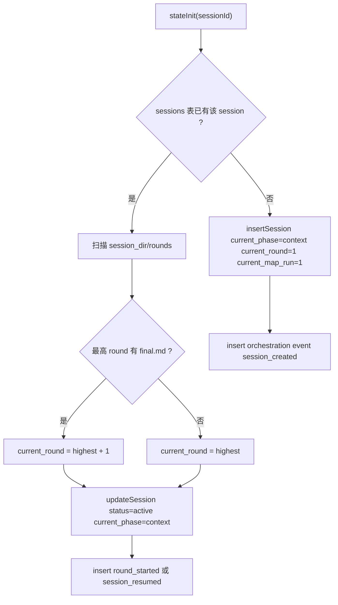

此外 `state init` 会尝试把 Dashboard parent execution 绑定到 session：

1. 优先用 `--dashboard-uid`
2. 其次用 `OCR_DASHBOARD_EXECUTION_UID`
3. 最后读 `.ocr/data/dashboard-active-spawn.json`

这解决了 AI 进程、Dashboard 进程、CLI 进程之间的 workflow linkage 问题。

### 10.5 Graph 命令

`ocr graph` 不修改 `ocr.db` 的 session state，它只读写 `.ocr/data/graph.db` 和 session 级 `graph-context.md/json`。

| 命令 | 作用 |
|---|---|
| `ocr graph status --json` | 查看 graph DB 是否 missing/ready/stale/error，以及 indexed/unsupported/node/edge 计数 |
| `ocr graph build --full --json` | 清空并全量重建 `.ocr/data/graph.db` |
| `ocr graph update --base origin/main --json` | 基于 git diff 增量更新 changed files |
| `ocr graph update --staged --json` | 增量更新 staged files |
| `ocr graph update --working-tree --json` | 增量更新 working tree files |
| `ocr graph query file_summary --target src/a.ts --json` | 查询单文件 nodes/edges |
| `ocr graph query callers_of/callees_of/imports_of/importers_of/tests_for --target ... --json` | 查询常见图谱关系 |
| `ocr graph query --stdin --json` | 从 stdin 读取 `GraphQuery` JSON，适合工具化调用 |
| `ocr graph impact --files "src/a.ts,src/b.ts" --depth 2 --json` | 计算 changed files 的影响半径 |
| `ocr graph context --workflow review --files "src/a.ts" --session-dir .ocr/sessions/{id} --json` | 生成 review graph context artifact |
| `ocr graph context --workflow map --base origin/main --session-dir .ocr/sessions/{id} --json` | 生成 map graph context artifact |

---

## 11. Dashboard 如何解析 Review 结果

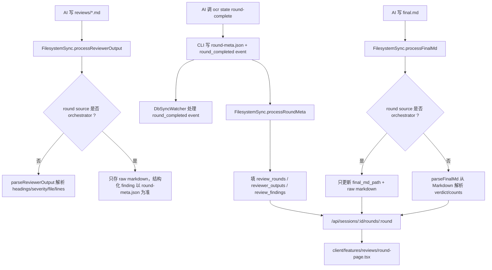

### 11.1 Orchestrator-first 优先

如果存在 `round-meta.json`，Dashboard 优先相信结构化数据：

- `review_rounds.source = 'orchestrator'`
- `processReviewerOutput()` 不再从 reviewer markdown 推导 findings
- `processFinalMd()` 不再从 final markdown 推导 counts
- `round-meta.json` 中的 `synthesis_counts` 决定 Dashboard summary 数量

如果没有 `round-meta.json`，Dashboard 才使用 fallback parser：

| Parser | 文件 | 解析能力 |
|---|---|---|
| `parseReviewerOutput()` | `packages/dashboard/src/server/services/parsers/reviewer-parser.ts` | 从 reviewer md 解析 findings |
| `parseFinalMd()` | `packages/dashboard/src/server/services/parsers/final-parser.ts` | 从 final md 解析 verdict/counts |

### 11.2 Review API 与页面

| 层 | 文件 | 作用 |
|---|---|---|
| API | `packages/dashboard/src/server/routes/reviews.ts` | rounds、findings、reviewer detail |
| Raw artifact API | `packages/dashboard/src/server/routes/artifacts.ts` | 读取 final/discourse/context/graph-context 等 raw markdown |
| Session API | `packages/dashboard/src/server/routes/sessions.ts` | 衍生 has_review、review_phase、latest_verdict |
| Page | `packages/dashboard/src/client/features/reviews/round-page.tsx` | GraphContextCard、VerdictBanner、ReviewerCard、FindingsTable、Discourse、Final Review、Ask the Team、Resume |

---

## 12. Dashboard 如何解析 Map 结果

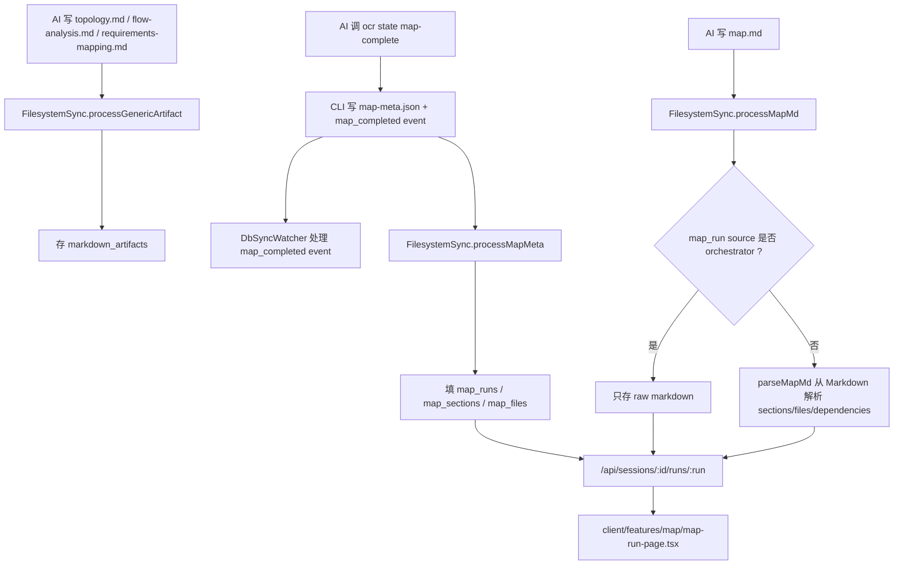

### 12.1 Orchestrator-first 优先

如果存在 `map-meta.json`，Dashboard 优先相信结构化 sections/files：

- `map_runs.source = 'orchestrator'`
- `processMapMd()` 不再从 Markdown 解析 sections/files
- `map.md` 只作为 raw markdown 保存，用于 Raw Map 和 chat context

如果没有 `map-meta.json`，Dashboard 使用 `parseMapMd()` fallback 解析：

- 支持 table 格式：`| File | Role | +42/-10 |`
- 支持 done table：`| Done | File | Role |`
- 支持 checkbox list：`- [ ] \`path\` — role`
- 支持 `## Section Dependencies` 表解析 dependency graph

### 12.2 Map API 与页面

| 层 | 文件 | 作用 |
|---|---|---|
| API | `packages/dashboard/src/server/routes/maps.ts` | map runs、sections、files、dependency graph |
| Raw artifact API | `packages/dashboard/src/server/routes/artifacts.ts` | 读取 raw `map.md` 和 `graph-context.md` |
| Parser | `packages/dashboard/src/server/services/parsers/map-parser.ts` | fallback 解析 sections/files/dependencies |
| Page | `packages/dashboard/src/client/features/map/map-run-page.tsx` | GraphContextCard、progress bar、section cards、dependency graph、raw map、Ask the Team |
| Progress | `packages/dashboard/src/client/features/map/hooks/use-map-run.ts` | toggle file reviewed、clear progress |

### 12.3 Dashboard 如何展示 Graph Context

Graph context 是 session-level artifact，不属于某个 round 或 map run：

```text
.ocr/sessions/{session-id}/graph-context.md
.ocr/sessions/{session-id}/graph-context.json
```

Dashboard 处理链路：

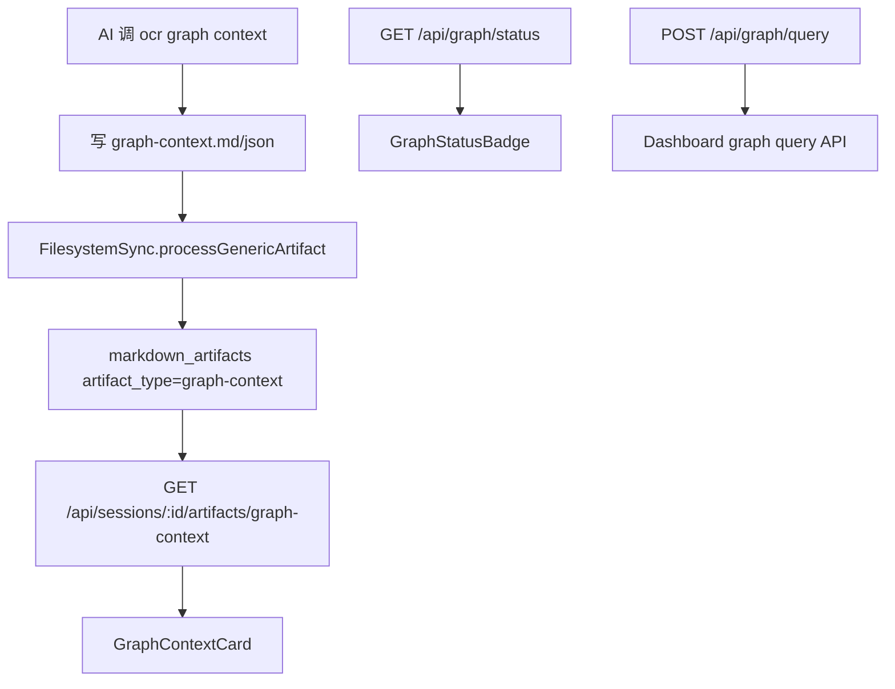

相关文件：

| 文件 | 作用 |
|---|---|
| `packages/dashboard/src/server/routes/graph.ts` | `GET /api/graph/status`、`POST /api/graph/query` |
| `packages/dashboard/src/server/routes/artifacts.ts` | 允许 artifact type `graph-context` |
| `packages/dashboard/src/server/services/filesystem-sync.ts` | 同步 session-level `graph-context.md` 到 `markdown_artifacts` |
| `packages/dashboard/src/client/features/graph/use-graph.ts` | 获取 graph status 和 graph-context artifact |
| `packages/dashboard/src/client/features/graph/graph-status-badge.tsx` | Session detail 上显示 graph ready/missing/stale/error |
| `packages/dashboard/src/client/features/graph/graph-context-card.tsx` | 展示 risk、changed symbols、changed ranges、impacted files、affected flows、test gaps、unsupported files、warnings 和 raw markdown |

Dashboard 不直接读取 `.ocr/data/graph.db`。服务端通过 `@open-code-review/graph` 内部 API 查询；前端通过 REST API 消费。

---

## 13. Progress 的实现方式

`ocr progress` 是 CLI 命令，用策略模式区分 review 和 map。

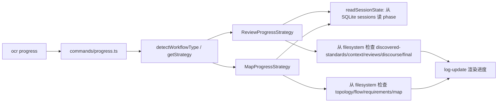

关键代码：

| 文件 | 关键逻辑 |
|---|---|
| `packages/cli/src/commands/progress.ts` | 监听 session 目录，周期刷新进度 |
| `packages/cli/src/lib/progress/review-strategy.ts` | review 8 阶段进度，统计 reviewer files 和 finding 数量 |
| `packages/cli/src/lib/progress/map-strategy.ts` | map 6 阶段进度，统计 run 和 file count |
| `packages/cli/src/lib/progress/session-reader.ts` | 从 SQLite `sessions` 表读取 current phase |

Progress 的核心原则：

- phase 当前值来自 SQLite。
- phase 完成度大量依赖文件存在性。
- 非标准文件名会导致进度展示不准。
- 如果 AI 跳过 `ocr state transition`，progress 会卡在旧阶段。

---

## 14. 关键代码逻辑逐文件解释

### 14.1 `packages/cli/src/index.ts`

这是 CLI 的总入口，注册子命令：

```text
init
progress
state
session
models
team
review
update
dashboard
doctor
reviewers
graph
```

关键点：

- 人类命令如 `init`、`dashboard`、`doctor` 会触发 update check。
- `review` 注册了，但 fresh review 当前不是这里完成；只支持 resume。
- 没有注册 `map` 子命令，map 是 AI workflow command。
- `graph` 是真实 CLI 子命令，直接调用内部 `@open-code-review/graph`。

### 14.2 `packages/cli/src/commands/review.ts`

当前 `ocr review` 的主要职责是 resume：

```bash
ocr review --resume <workflow-id>
```

逻辑：

1. 没有 `--resume` 则输出提示：fresh review 应从 AI slash command 或 Dashboard 开始。
2. 检查 `.ocr` 设置。
3. 打开 DB。
4. 根据 workflow id 找 session。
5. 找最近一个带 `vendor_session_id` 的 agent/execution row。
6. 根据 vendor 生成 resume args。
7. `spawn()` 对应 AI CLI，并继承 stdio，把控制权交给用户。

这说明 OCR CLI 本身不是 review 算法执行器，而是 workflow 状态和 handoff 的基础设施。

### 14.3 `packages/dashboard/src/server/socket/command-runner.ts`

Dashboard 发起 review/map 的核心。

主要逻辑：

1. `shellSplit()` 解析用户命令，支持简单引号。
2. `ALLOWED_COMMANDS` 只允许 `progress`、`state` 这类 utility。
3. `AI_COMMANDS` 允许 `map`、`review`、`address`、`create-reviewer`、`sync-reviewers` 等 AI workflow。
4. `registerCommandHandlers()` 处理 socket `command:run`。
5. 插入 `command_executions` parent row，生成 execution uid。
6. 如果是 utility command，走 `spawnCliCommand()`。
7. 如果是 AI command，走 `spawnAiCommand()`。
8. `buildPrompt()` 读取 `.ocr/commands/{command}.md` 并组合 prompt。
9. `adapter.spawn()` 启动 Claude/OpenCode。
10. stdout 由 adapter parser 转换为 `NormalizedEvent`，再写 JSONL event journal 并 emit 给前端。
11. 观察到 vendor `session_id` 后通过 `SessionCaptureService` 记录到 DB。
12. 进程结束后更新 `command_executions.exit_code/finished_at/output`。

值得重点看的防御逻辑：

- `escapeUserHeaders()`：用户输入被放进 fenced block 前会转义 header/fence，防 prompt injection。
- prompt sandwich：可信块先于用户参数出现。
- `dashboard-active-spawn.json`：解决 workflow id 与 Dashboard execution row 的可靠绑定。
- UTF-8 `setEncoding('utf-8')`：避免多字节字符跨 chunk 导致 JSON parse 丢事件。

### 14.4 `packages/dashboard/src/server/services/ai-cli/*`

AI CLI adapter 把不同 vendor 的启动方式和输出格式统一。

公共接口在 `types.ts`：

```ts
interface AiCliAdapter {
  name: string
  binary: string
  supportsPerTaskModel: boolean
  detect(): DetectionResult
  spawn(opts: SpawnOptions): SpawnResult
  createParser(): LineParser
  listModels(): Promise<ModelDescriptor[]>
}
```

Claude Code：

- 命令：`claude --print --output-format stream-json --verbose --include-partial-messages`
- workflow mode 默认 `--max-turns 500`
- workflow tools 包含 `Read`、`Write`、`Edit`、`Bash`、`Glob`、`Grep`、`TodoWrite`、`TodoRead`、`Task`
- 支持 `--model`
- 支持 `--resume`
- parser 处理 `text_delta`、`thinking_delta`、tool input delta、tool result、session_id

OpenCode：

- 命令：`opencode run <prompt> --format json --agent build`
- resume：`--session <id> --continue`
- 支持 parent `--model`
- 不支持 per-subagent model override
- parser 把 OpenCode 的 `text`、`tool_use`、`reasoning`、`error` 转成统一事件

### 14.5 `packages/cli/src/commands/state.ts` 与 `packages/cli/src/lib/state/index.ts`

这是 workflow 状态的核心。

命令层做：

- 参数校验
- `.ocr` setup guard
- stdin/file JSON 读取
- 调用 lib/state
- 错误输出与 exit

lib/state 做：

- `ensureDatabase()`
- session insert/update
- orchestration event insert
- round/map meta schema validation
- 写 `round-meta.json` / `map-meta.json`
- 计算 counts

两个结构化完成命令最重要：

| 命令 | 校验 | 写文件 | 插事件 |
|---|---|---|---|
| `round-complete` | `schema_version`、`verdict`、reviewers、findings、category、severity、`synthesis_counts` | `rounds/round-{n}/round-meta.json` | `round_completed` |
| `map-complete` | `schema_version`、sections、files、dependencies | `map/runs/run-{n}/map-meta.json` | `map_completed` |

### 14.6 `packages/cli/src/commands/session.ts` 与 `packages/cli/src/lib/db/agent-sessions.ts`

这部分支撑 Dashboard 的 liveness、terminal handoff、resume。

状态推导：

| DB 字段 | 状态 |
|---|---|
| `finished_at IS NULL` 且 heartbeat 新鲜 | `running` |
| `finished_at IS NULL` 且 heartbeat 过期 | UI 下游可视为 stalled |
| `exit_code = 0` | `done` |
| `exit_code = -2` | `cancelled` |
| `exit_code = -3` | `orphaned` |
| 其他非空 exit_code | `crashed` |

命令：

| 命令 | 作用 |
|---|---|
| `start-instance` | 插入一条带 `last_heartbeat_at` 的 `command_executions` row |
| `bind-vendor-id` | 绑定 vendor session id，重复绑定不同值会拒绝 |
| `beat` | 更新 heartbeat |
| `end-instance` | 设置 exit_code/finished_at/notes |
| `list` | 查看某 workflow 下 agent sessions |

### 14.7 `packages/cli/src/lib/team-config.ts`

`default_team` 的单一解析真源。

支持三种 form：

```yaml
default_team:
  principal: 2
  quality:
    count: 2
    model: workhorse
  security:
    - model: claude-opus-4-7
      name: security-deep
```

模型解析链：

```text
instance model > team-level model > models.default > null
```

如果命中 `models.aliases`，会展开 alias。

Session override：

- Dashboard Command Center 的 team panel 会把本次选择序列化成 JSON。
- `ocr team resolve --session-override <json>` 会用 override persona 替换对应默认 persona。
- override 不持久化到 `.ocr/config.yaml`。

### 14.8 `packages/dashboard/src/server/services/filesystem-sync.ts`

这是 Dashboard 从文件系统吸收结果的核心。

它做两类工作：

1. full scan：服务启动时扫描所有 `.ocr/sessions`。
2. watch：用 chokidar 监听 `.md` / `.json` 新增或变更。

Review 处理：

- `processReviewerOutput()`：解析 `reviews/*.md` 或只存 raw markdown。
- `processRoundMeta()`：解析 `round-meta.json`，写 `review_rounds`、`reviewer_outputs`、`review_findings`。
- `processFinalMd()`：解析或存储 `final.md`，必要时把 session 推到 complete。
- `processGenericArtifact()`：存 discourse/context/discovered-standards 等 raw markdown。

Map 处理：

- `processMapMeta()`：解析 `map-meta.json`，写 `map_runs`、`map_sections`、`map_files`。
- `processMapMd()`：如果没有 meta，用 parser 从 `map.md` 提取 sections/files；否则只存 raw markdown。
- `processGenericArtifact()`：存 topology/flow-analysis/requirements-mapping。

保护用户进度：

- 重新解析前会 stash `user_file_progress` 或 `user_finding_progress`。
- 重建 sections/findings 后再按 file/finding key 恢复进度。

### 14.9 `packages/dashboard/src/server/services/db-sync-watcher.ts`

Dashboard server 内存里有一份 sql.js DB，CLI 命令会写磁盘上的 `.ocr/data/ocr.db`。`DbSyncWatcher` 负责把磁盘变更同步回来。

核心逻辑：

1. 监听 DB 所在目录，而不是单个文件，因为 CLI 用 atomic rename。
2. 读取前校验 SQLite magic header，避免读到半写文件。
3. `syncSessions()`：同步 CLI 权威的 phase/status/current_round/current_map_run。
4. `syncEvents()`：同步 append-only orchestration events。
5. `syncAgentSessions()`：同步 command_executions 中的 workflow_id、vendor_session_id、heartbeat、exit_code 等。
6. 新增 `round_completed` event 时更新 `review_rounds`。
7. 新增 `map_completed` event 时更新 `map_runs`。

### 14.10 Dashboard routes 与 client pages

Review：

| 文件 | 说明 |
|---|---|
| `packages/dashboard/src/server/routes/reviews.ts` | round list/detail、round findings、reviewer detail |
| `packages/dashboard/src/client/features/reviews/round-page.tsx` | final review、discourse、findings、reviewer cards、post、address feedback、handoff |

Map：

| 文件 | 说明 |
|---|---|
| `packages/dashboard/src/server/routes/maps.ts` | map run list/detail、sections、graph |
| `packages/dashboard/src/client/features/map/map-run-page.tsx` | file review progress、section cards、dependency graph、raw map、chat |

Graph：

| 文件 | 说明 |
|---|---|
| `packages/dashboard/src/server/routes/graph.ts` | graph status 与 query API |
| `packages/dashboard/src/client/features/graph/graph-status-badge.tsx` | session detail graph 状态徽标 |
| `packages/dashboard/src/client/features/graph/graph-context-card.tsx` | review/map 页面 graph context 摘要 |

Session：

| 文件 | 说明 |
|---|---|
| `packages/dashboard/src/server/routes/sessions.ts` | enrich session，派生 has_review/has_map/review_phase/map_phase/latest verdict |
| `packages/dashboard/src/client/features/sessions/session-detail-page.tsx` | Review/Map tab、phase timeline、events、liveness |

### 14.11 `packages/shared/graph`

内部 graph engine 的读法建议：

| 文件 | 先看什么 |
|---|---|
| `src/types.ts` | `GraphNode`、`GraphEdge`、`GraphFlow`、`GraphContext` 的形状 |
| `src/storage/db.ts` | schema、GraphStore、flows CRUD、status/stale 判断 |
| `src/language.ts` | 七种语言和扩展名映射 |
| `src/parsers/parser.ts` | Tree-sitter-first 解析、Vue script 解析、SQL heuristic、`TESTED_BY` |
| `src/indexer/indexer.ts` | `buildGraph` / `updateGraph`、hash skip、删除文件清理、stale 保护 |
| `src/indexer/node-resolver.ts` | Node.js CommonJS/ESM/package.json resolution 和 `DEPENDS_ON` |
| `src/indexer/flow-detector.ts` | entry point 识别、有限 BFS、`graph_flows` 重建 |
| `src/query/query.ts` | pattern queries 和 impact radius |
| `src/context/context.ts` | risk score、test gaps、affected flows、Markdown/JSON artifact |
| `src/graph.test.ts` | 七语言 fixture、Node resolver、incremental update、stale、affected flows 的回归测试 |

### 14.12 Graph 相关测试覆盖

Graph 能力横跨 shared package、CLI、e2e 和 Dashboard，测试也分层放置。新人改图谱相关代码时，至少要知道每一层在防什么退化：

| 测试文件 | 覆盖重点 |
|---|---|
| `packages/shared/graph/src/graph.test.ts` | 图谱引擎核心回归：七类语言索引、unsupported 统计、Node.js resolver、full build、incremental update、删除文件清理、stale 保护、pattern query、impact radius、graph context artifact、affected flows |
| `packages/cli/src/commands/__tests__/graph.test.ts` | CLI 参数转发和 JSON 输出：`status/build/update/query/impact/context` 子命令、`--stdin` 查询、`--files` 解析、`--session-dir`、`--no-write-artifacts` |
| `packages/cli-e2e/src/graph.test.ts` | bundled CLI smoke：在临时 git repo 中真实执行 `ocr graph status/build/query/impact/context`，验证 `.ocr/data/graph.db` 与 `graph-context.md/json` 能从打包后的 CLI 正常生成 |
| `packages/dashboard/src/server/routes/__tests__/graph.test.ts` | Dashboard Graph API：无 graph DB 时 `/api/graph/status` 返回 missing，`/api/graph/query` 返回非阻断 empty，确保 Dashboard 不因图谱缺失失败 |
| `packages/dashboard/src/client/features/graph/__tests__/graph-ui.test.tsx` | Dashboard UI：`GraphStatusBadge` 展示 ready/missing 状态，`GraphContextCard` 摘要 risk、changed symbols、changed ranges、impacted files、affected flows、test gaps、unsupported files、warnings 和 raw markdown |
| `packages/dashboard/src/server/services/__tests__/filesystem-sync.test.ts` | artifact 同步：session-level `graph-context.md` 作为 `graph-context` artifact 入库，供 review/map 页面读取 |

常用回归命令：

```bash
pnpm nx test graph
pnpm nx test cli -- --run packages/cli/src/commands/__tests__/graph.test.ts
pnpm nx e2e cli-e2e -- --run packages/cli-e2e/src/graph.test.ts
pnpm nx test dashboard -- --run packages/dashboard/src/server/routes/__tests__/graph.test.ts packages/dashboard/src/client/features/graph/__tests__/graph-ui.test.tsx
```

这里的 `cli-e2e` 很关键：它验证的是 `packages/cli/dist/index.js` 打包产物能不能加载内部 `@open-code-review/graph` 和 Tree-sitter 相关 runtime，而不是只验证 TypeScript 源码层面的 mock。

---

## 15. 新人阅读代码建议路线

建议按下面顺序读，不要一上来从 React 页面开始：

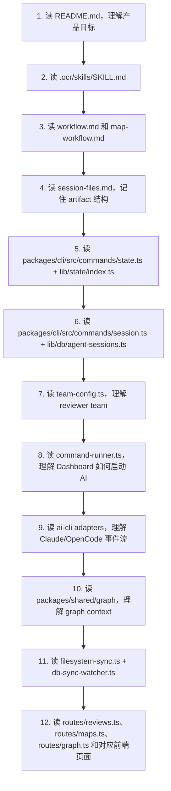

最低限度要掌握的六个事实：

1. Review/map 的“算法流程”主要写在 `.ocr/skills/references/*.md`，由宿主 AI 执行。
2. CLI 的核心价值是 state、session journal、metadata validation、progress、install、team resolve。
3. Dashboard 发起 workflow 时是启动 AI CLI，不是在 Node 里直接跑 reviewer。
4. `round-meta.json` / `map-meta.json` 是结构化真源，Markdown parser 是 fallback。
5. `graph-context.md/json` 是辅助上下文，不是 findings 或 map canonical file list 的权威来源。
6. 文件命名和 phase transition 是系统可观测性的基础，乱写会破坏 progress 和 Dashboard。

---

## 16. 常见问题

### 16.1 为什么 `ocr review` 不直接跑完整 review？

因为当前 fresh review 的执行模型是 AI-native：让 Claude Code / OpenCode 按 `.ocr/commands/review.md` 和 `.ocr/skills/references/workflow.md` 自主调用工具、spawn reviewer、写产物。`ocr review --resume` 只负责恢复已有 workflow 的 vendor 会话。

### 16.2 为什么要有 `round-meta.json` 和 `final.md` 两份结果？

它们服务不同消费者：

| 文件 | 消费者 | 目的 |
|---|---|---|
| `final.md` | 人类、Dashboard markdown renderer、GitHub post | 可读的最终 review |
| `round-meta.json` | CLI/Dashboard | 稳定、可校验、可统计的结构化 findings/counts |

### 16.3 为什么 Dashboard 还要 parse Markdown？

兼容旧产物和不完整 workflow。如果没有 `round-meta.json` 或 `map-meta.json`，Dashboard 仍能从 Markdown 中尽力提取信息。但新流程应优先使用 orchestrator-first meta JSON。

### 16.4 为什么要通过 CLI 写 `round-meta.json` / `map-meta.json`？

因为 CLI 会：

1. 校验 JSON schema。
2. 写到正确 session/round/run 目录。
3. 原子记录 orchestration event。
4. 保证 Dashboard 能实时发现完成事件。

如果 AI 直接手写 JSON，Dashboard 可能看得到文件，但缺少事件或 schema 不可信。

### 16.5 Reviewers 是真的并发进程吗？

取决于宿主 AI CLI。OCR 的规范要求 Tech Lead spawn reviewer sub-agents，并通过 `ocr session start-instance` 等命令记录生命周期。Dashboard 不在 `command-runner.ts` 里 fork 每个 reviewer；它只启动父 AI workflow。子 agent 的实际执行由 Claude Code / OpenCode 等宿主 CLI 能力决定。

### 16.6 Map 里的 dependency graph 从哪里来？

主要从 `map.md` 的 `## Section Dependencies` 表解析，或者从 `map-meta.json` 中的 dependencies 结构化数据进入 DB。前端 `DependencyGraph` 使用 `/api/sessions/:id/runs/:run/graph` 和 map sections 渲染。

这和内部 code graph 不是同一个东西：

| 名称 | 来源 | 用途 |
|---|---|---|
| Map dependency graph | `map-meta.json.dependencies` 或 `map.md` 的 Section Dependencies | 展示 map sections 之间的人类导航关系 |
| Code graph | `.ocr/data/graph.db` | 查询代码 nodes/edges、impact radius、test gaps、affected flows |
| Graph context | `graph-context.md/json` | 把 code graph 信号压缩成 review/map 可消费的辅助上下文 |

### 16.7 如果 AI 写了 `final.md` 但没调用 `ocr state close` 怎么办？

`FilesystemSync.processFinalMd()` 有 safety net：如果发现 `final.md` 存在但 session 还卡在早期 phase，会把 session 推到 `complete` 并标记 closed。Map 的 `processMapMd()` 也有类似逻辑，会把 map workflow 推到 complete。

### 16.8 为什么 graph.db 不放进 ocr.db？

`ocr.db` 是 workflow/session 状态库，里面的数据是用户流程的事实来源；`graph.db` 是可重建的代码索引缓存。分库可以避免大规模图谱重建影响 session 状态，也让未来清理或重建 graph 不触碰 review/map 历史。

### 16.9 SQL 为什么不是 Tree-sitter？

当前 `@vscode/tree-sitter-wasm` 运行时提供的 grammar 不包含 SQL/Vue。Vue 通过 `<script>` / `<script lang="ts">` 复用 JS/TS parser；SQL v1 使用启发式 parser，只承诺提取表/视图/函数节点和基础依赖，不承诺完整 SQL 方言语义。

---

## 17. Review 与 Map 关键路径对照表

| 维度 | Review | Map |
|---|---|---|
| 目标 | 找问题、给 verdict、产出 actionable feedback | 帮人类理解大 changeset、组织 review 顺序 |
| 主角色 | Tech Lead | Map Architect |
| 阶段数 | 8 | 6 |
| 重复单位 | round | run |
| 核心子 agent | reviewer personas，如 principal/quality/security/testing | flow analysts、requirements mappers |
| 主要产物 | `reviews/*.md`、`discourse.md`、`round-meta.json`、`final.md` | `topology.md`、`flow-analysis.md`、`requirements-mapping.md`、`map-meta.json`、`map.md` |
| 结构化真源 | `round-meta.json` | `map-meta.json` |
| 图谱辅助产物 | `graph-context.md/json`，用于 reviewer guidance 和优先级 | `graph-context.md/json`，用于 topology/flow-analysis/map synthesis |
| Dashboard 主表 | `review_rounds`、`reviewer_outputs`、`review_findings` | `map_runs`、`map_sections`、`map_files` |
| 用户进度 | finding/round triage | file checkbox |
| 是否 close session | Phase 8 close | Phase 6 通常不 close |
| 是否依赖另一个流程 | 不默认依赖 map | 不依赖 review |

---

## 18. 最小端到端心智模型

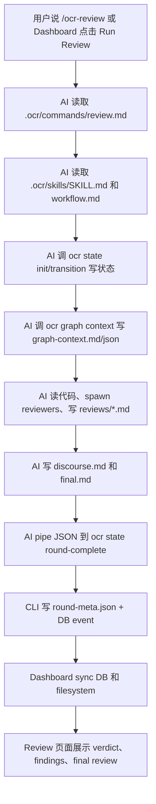

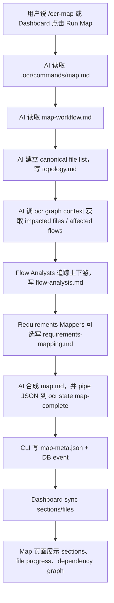

---

## 19. 后续修改时的注意事项

1. 改 phase 名称时，要同步 `.ocr/skills/references/*.md`、`packages/cli/src/lib/state/types.ts`、`packages/cli/src/commands/state.ts`、Dashboard `session-detail-page.tsx`、progress strategies。
2. 改 artifact 文件名时，要同步 `session-files.md`、workflow 文档、`FilesystemSync.processChangedFile()`、progress strategies。
3. 改 `round-meta.json` 或 `map-meta.json` schema 时，要同步 CLI validation、Dashboard `processRoundMeta/processMapMeta`、前端类型和测试。
4. 改 `default_team` 配置格式时，要优先改 `team-config.ts`，不要让 Dashboard 或 AI 侧重复实现解析。
5. 改 AI CLI 事件格式时，只改 adapter parser，保持 `NormalizedEvent` 稳定。
6. 改 Dashboard 写 DB 的地方时，要理解 `saveDb()` 的 merge-before-write，否则可能覆盖 CLI 刚写入的 state。
7. 新增 reviewer persona 时，要放到 `.ocr/skills/references/reviewers` 或 `packages/agents/skills/ocr/references/reviewers`，并更新 metadata 生成逻辑或运行 sync。
8. 新增 map 输出字段时，优先扩展 `map-meta.json`，不要只依赖 Markdown parser。
